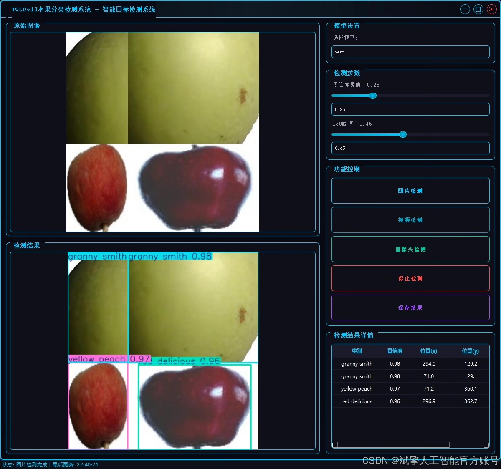
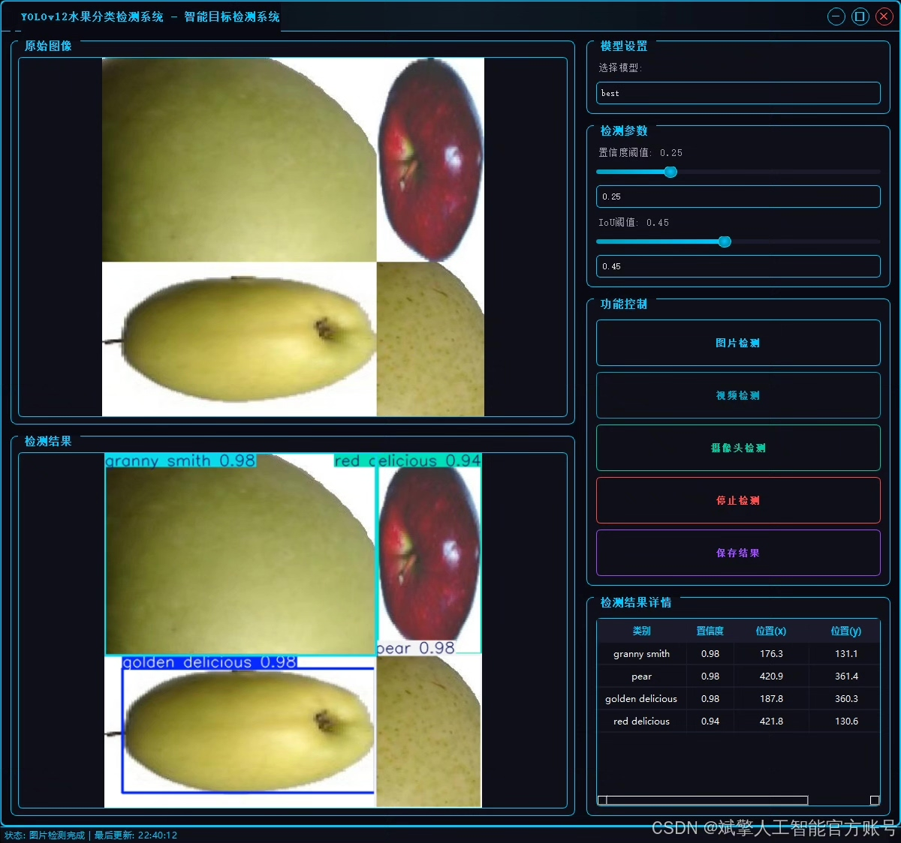
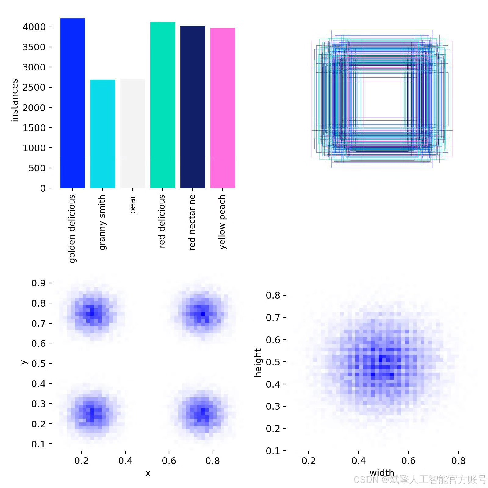
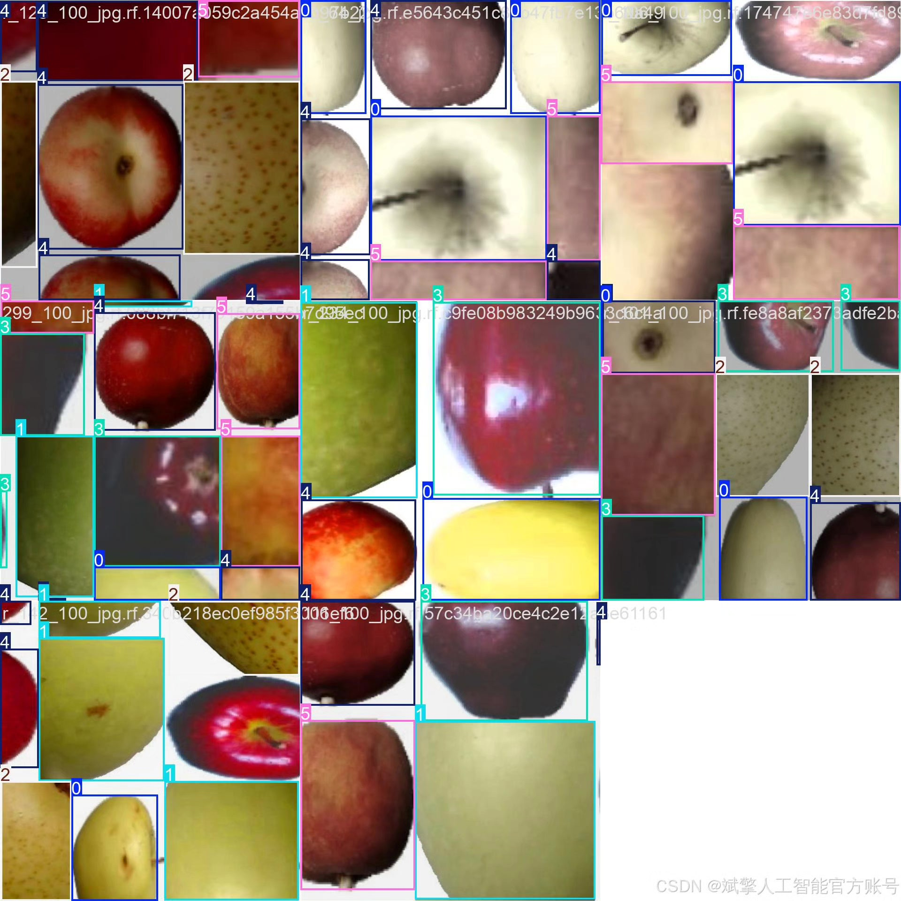
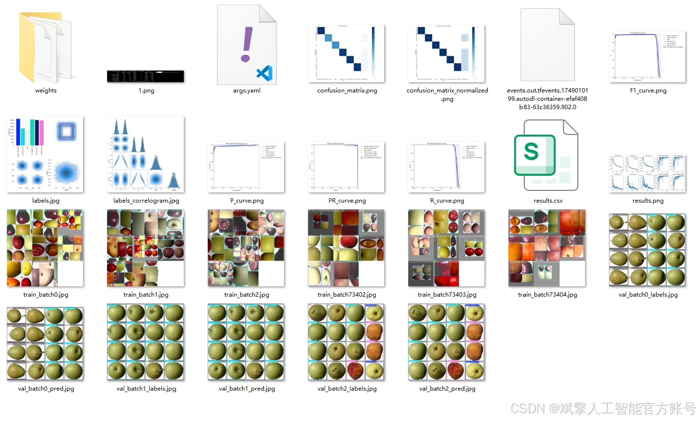
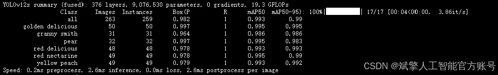
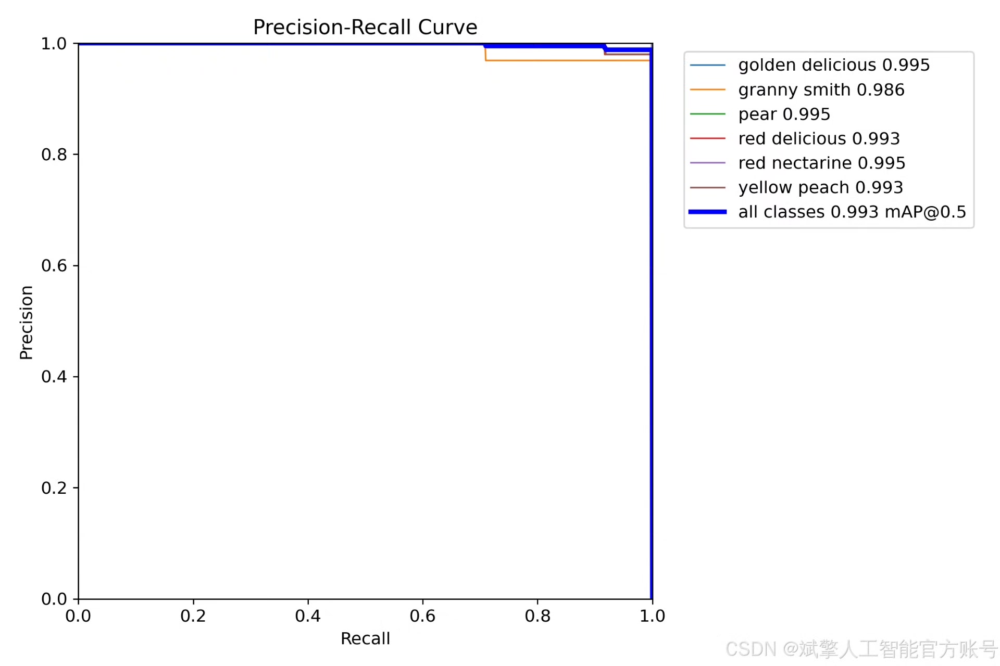
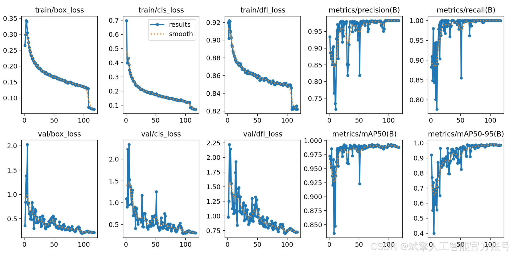
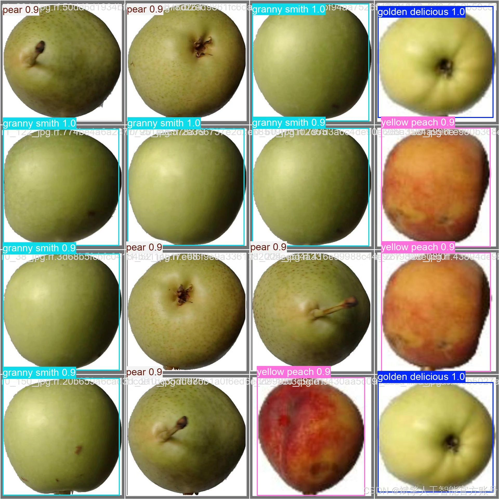

# YOLOv12 Fruit Recognition Software Resources

## Body

YOLOv12 Fruit Identification Software Resources Based on Deep Learning YOLOv12: A Fruit Identification and Detection System (YOLOv12+YOLO dataset + UI interface + login registration interface + Python project source code + model)

This article is based on the YOLOv12 deep learning framework to build an efficient fruit classification and identification detection system. It supports real-time detection and classification of six types of fruits, including Golden Delicious apples, Granny Smith apples, Pears, Red Delicious apples, Red Nectarines, and Yellow Peaches. The system uses the YOLOv12 algorithm for model training and optimization, combined with a custom dataset containing 5481 training images and 263 validation images, achieving high accuracy in target detection and classification. Additionally, the system integrates a user-friendly UI interface and includes login registration functions. Experimental results show that the system has good robustness and real-time performance under complex scenarios, providing technical support for agricultural automation and intelligent retail.

✅ User Login Registration: Supports password verification and security validation.
✅ Three detection modes: Based on the YOLOv12 model, supporting image, video, and real-time camera detection, accurately recognizing targets.
✅ Dual-screen comparison: Displaying the original scene and detection results simultaneously on the screen.
✅ Data visualization: Real-time table displaying the category, confidence, and coordinates of detected targets.
✅ Intelligent parameter adjustment: Offers a confidence slide bar for dynamically optimizing detection accuracy to meet different scene needs.
✅ Sci-fi style interactive interface: Dark theme paired with dynamic light effects, reducing visual fatigue and enhancing operational experience.

## Images

## Payment

Here is a pay link on Stripe ( https://buy.stripe.com/3cs8yP7sY87d0vu9AB ). Please contact me lonlonago@foxmail.com after funding $89, and I will send you a complete data files , thank you!

